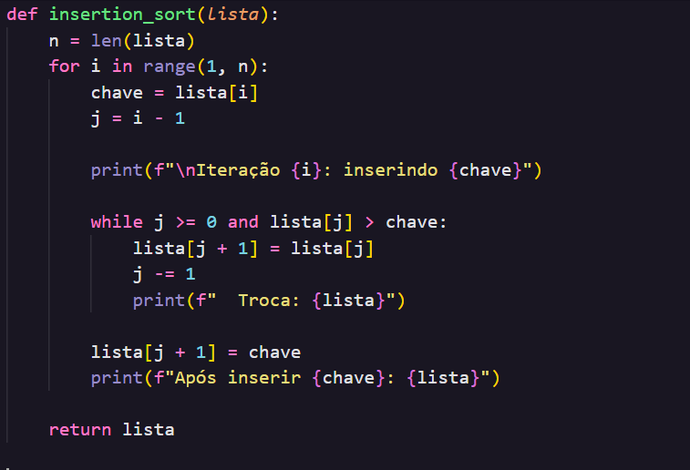
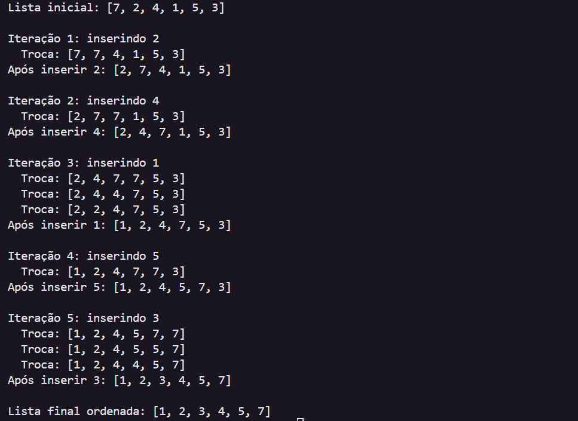

# 🟦 Insertion Sort em Python

Implementação do algoritmo **Insertion Sort** 
---

## 📌 Descrição

O **Insertion Sort** é um algoritmo de ordenação simples, estável e eficiente para listas pequenas ou quase ordenadas.  
Ele funciona inserindo cada elemento na posição correta dentro de uma parte já ordenada do vetor.

---

## 🚀 Funcionalidades

- Ordenação de listas em **ordem crescente**  
- Exibição do **estado do vetor a cada iteração**  
- Indicação das **trocas realizadas**  

---

## 🧩 Teste

## Conclusão – Insertion Sort Simples

O Insertion Sort é um algoritmo de ordenação fácil de entender e implementar, sendo ideal para listas pequenas ou quase ordenadas. Ele insere cada elemento na posição correta, deslocando os maiores para a direita. Apesar de sua simplicidade, apresenta complexidade O(n²) no pior e no caso médio, o que o torna ineficiente para listas muito grandes. No entanto, para pequenos conjuntos de dados, ele é rápido, estável e eficiente, além de permitir acompanhar facilmente o processo de ordenação passo a passo.
